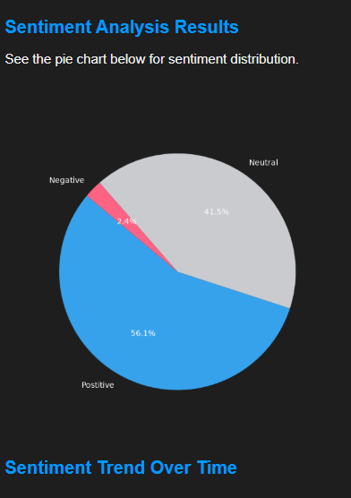
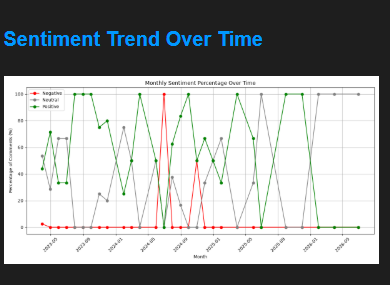

yt-comment-sentiment-analysis
==============================

A small chrome plugin to detect youtube comment sentiments
==============================
Snaps:

Project Organization
------------

    ├── LICENSE
    ├── Makefile           <- Makefile with commands like `make data` or `make train`
    ├── README.md          <- The top-level README for developers using this project.
    ├── data
    │   ├── external       <- Data from third party sources.
    │   ├── interim        <- Intermediate data that has been transformed.
    │   ├── processed      <- The final, canonical data sets for modeling.
    │   └── raw            <- The original, immutable data dump.
    │
    ├── docs               <- A default Sphinx project; see sphinx-doc.org for details
    │
    ├── models             <- Trained and serialized models, model predictions, or model summaries
    │
    ├── notebooks          <- Jupyter notebooks. Naming convention is a number (for ordering),
    │                         the creator's initials, and a short `-` delimited description, e.g.
    │                         `1.0-jqp-initial-data-exploration`.
    │
    ├── references         <- Data dictionaries, manuals, and all other explanatory materials.
    │
    ├── reports            <- Generated analysis as HTML, PDF, LaTeX, etc.
    │   └── figures        <- Generated graphics and figures to be used in reporting
    │
    ├── requirements.txt   <- The requirements file for reproducing the analysis environment, e.g.
    │                         generated with `pip freeze > requirements.txt`
    │
    ├── setup.py           <- makes project pip installable (pip install -e .) so src can be imported
    ├── src                <- Source code for use in this project.
    │   ├── __init__.py    <- Makes src a Python module
    │   │
    │   ├── data           <- Scripts to download or generate data
    │   │   └── make_dataset.py
    │   │
    │   ├── features       <- Scripts to turn raw data into features for modeling
    │   │   └── build_features.py
    │   │
    │   ├── models         <- Scripts to train models and then use trained models to make
    │   │   │                 predictions
    │   │   ├── predict_model.py
    │   │   └── train_model.py
    │   │
    │   └── visualization  <- Scripts to create exploratory and results oriented visualizations
    │       └── visualize.py
    │
    └── tox.ini            <- tox file with settings for running tox; see tox.readthedocs.io

--------

. Environment & Dependencies
Clone the codebase and restore the virtual matrix environment profile:

git clone [https://github.com/yourusername/yt-comment-sentiment-analysis.git](https://github.com/yourusername/yt-comment-sentiment-analysis.git)
cd yt-comment-sentiment-analysis

python -m venv venv
source venv/bin/activate  # On Windows use `venv\Scripts\activate`
pip install -r requirements.txt
pip install -e .

2. Restoring Assets via DVC
The target binaries (lgbm_model.pkl & tfidf_vectorizer.pkl) along with processed operational data targets are versioned safely in an external remote storage layer. To pull the exact versions bound to this Git branch revision, run:

# Pull model and vectorizer checkpoints instantly
dvc pull

If configuring a new model artifact or text transform file snapshot manually, track changes via:

dvc add models/lgbm_model.pkl models/tfidf_vectorizer.pkl
git add models/lgbm_model.pkl.dvc models/tfidf_vectorizer.pkl.dvc .gitignore
git commit -m "chore: update tracked model weights binary via dvc"
# Web Framework & CORS
Flask==3.1.3
flask-cors==6.0.5

# Machine Learning & Model Inference
lightgbm==4.6.0
scikit-learn==1.9.0
joblib==1.5.3

# Data Manipulation & DataFrames
numpy==2.4.6
pandas==2.3.3

# NLP & Text Preprocessing
nltk==3.9.4
regex==2026.5.9

# Graphics, Plots, and Word Clouds
matplotlib==3.11.0
wordcloud==1.9.6